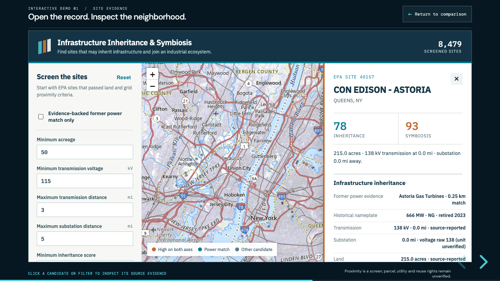

# Data Center Locator

**Explore infrastructure inheritance and industrial symbiosis for potential data center sites.**

A geospatial screening prototype that connects U.S. public records with interactive maps, candidate comparisons, and a browser presentation. It explores whether existing industrial infrastructure and nearby facilities could support urban AI inference locations.

[Quick start](#quick-start) · [Presentation & downloads](#presentation--downloads) · [Data documentation](README_DATA.md) · [Validation report](outputs/validation/validation_report.md)



## What you can explore

- **Site explorer:** filter 8,479 screened candidates, inspect site evidence, and explore nearby industrial and wastewater facilities.
- **Two independent scores:** compare infrastructure inheritance and industrial symbiosis without combining them into an overall ranking.
- **Power and connectivity preview:** switch between maps, a comparison chart, and a sortable table of power and PeeringDB proximity indicators.
- **Browser presentation:** a 16:9 reveal.js deck with restrained animations, two embedded interactive demos, and speaker notes.

## Quick start

You need Git, Node.js, a modern browser, and an internet connection. Install Git LFS if you want the complete raw-data archive; it is not required to serve the prebuilt demos.

```sh
git clone https://github.com/ubique888/dataCenterLocator_public.git
cd dataCenterLocator_public
node presentation/browser/serve.mjs
```

Open one of these local URLs while the server is running:

| View | Local URL |
|---|---|
| Browser presentation | http://127.0.0.1:4173/presentation/browser/ |
| Interactive site explorer | http://127.0.0.1:4173/outputs/infrastructure_inheritance_symbiosis.html |
| Power and connectivity preview | http://127.0.0.1:4173/outputs/power_connectivity_preview.html |

In the presentation, use the arrow keys or **Space** to advance and **S** for speaker notes. On an embedded demo slide, click **Return to comparison** or press **Escape** to return to the comparison slide. Use `--port 4174` if the default port is occupied.

The prebuilt demos need no Python environment or data rebuild. Reveal.js, fonts, map libraries, tiles, and some map geometry load from external services, so playback is not fully offline. See the [browser guide](presentation/browser/README.md) for details.

## Presentation & downloads

| Deliverable | File |
|---|---|
| Editable seven-slide PowerPoint | [presentation.pptx](presentation/output/presentation.pptx) |
| PDF presentation | [presentation.pdf](presentation/output/presentation.pdf) |
| 50-second screenshot tour | [interactive-demo-tour.webm](presentation/output/interactive-demo-tour.webm) |
| Speaker notes | [speaker_notes.md](presentation/speaker_notes.md) |
| Fixed-order recording instructions | [recording-script.md](presentation/browser/recording-script.md) |

The browser version follows the seven-slide narrative and adds two interactive demo slides. The video shows five site-explorer screenshots followed by five presentation screenshots, each held for five seconds.

## Data & methodology

The pipeline retains **190,976 EPA RE-Powering records** and identifies **8,479 candidates** using reported acreage of at least 50 acres, transmission distance of at most 3 miles, transmission voltage of at least 115 kV, and substation distance of at most 5 miles. Missing filter inputs do not pass.

| Source | Screening evidence |
|---|---|
| EPA RE-Powering | Land and reported infrastructure proximity |
| EIA-860M | Retired generating assets and historical nameplate capacity |
| EPA Facility Registry Service | Nearby facilities in selected manufacturing categories |
| EPA Clean Watersheds Needs Survey | Wastewater treatment locations and reported design flow |
| PeeringDB | Listed IXP-hosting facilities and registered network counts |

Source versions, field mappings, score formulas, missing-data handling, and validation results are documented in [README_DATA.md](README_DATA.md). Raw inputs are under `data/raw/`, derived Parquet tables under `data/processed/`, and checks under `outputs/validation/`.

For data processing, install the dependencies in [requirements.txt](requirements.txt) in a Python virtual environment. To retrieve the large raw archive after installing Git LFS, run `git lfs install` and `git lfs pull` from the repository root. Processing scripts are in `scripts/`; shared logic is in `src/`, with tests in `tests/`.

## Interpretation limits

This is an exploratory screening tool. Candidate scores and proximity measurements do not establish buildable parcels, available grid capacity, interconnection rights, fiber routes, measured latency, heat offtake, or usable reclaimed water.

Retired MW is historical nameplate capacity. CWNS flow is design capacity. Nearby manufacturers are potential leads with unverified heat demand and willingness to participate. The 50-acre filter may exclude compact urban opportunities. Astoria is a due-diligence lead; the long-term presentation scenario is conditional.
